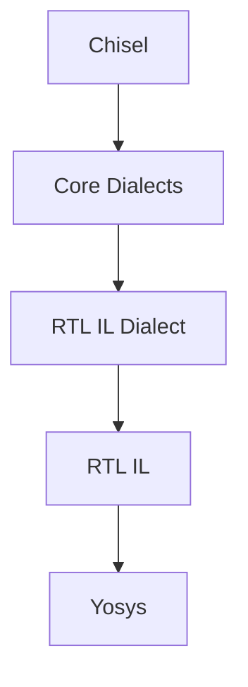

# CIRCT and Yosys interoperability

This is a mockup integration of CIRCT and Yosys. By directly integrating both tools, the intermediate setup with Verilot files is not needed.

```mermaid
graph TD
    Chisel-->CoreDialects["Core Dialects"]
    CoreDialects-->RTLILDialect["RTL IL Dialect"]
    RTLILDialect-->RTLIL["RTL IL"]
    RTLIL-->Yosys
```

